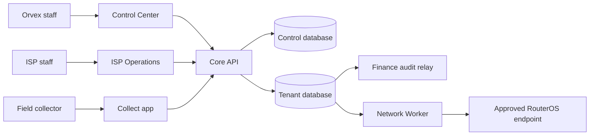

# Orvex ISP

Orvex ISP is a bilingual, multi-tenant operations platform built for internet service providers in
Lebanon. It brings subscriber operations, billing, collections, field work, network automation,
support access, and platform administration into one controlled system.

The product is designed around a simple separation of responsibilities:

- **Orvex Control Center** is used by Orvex staff to operate the platform and support ISP clients.
- **ISP Operations** is the private workspace used by each ISP's authorized team.
- **Orvex ISP Collect** is the Android-first field application for assigned collectors.
- **Core API and workers** enforce the business, security, finance, and network rules behind every
  interface.

Orvex ISP is **not** a subscriber self-service portal. Subscribers do not receive accounts, logins,
or access to the internal applications.

## Live environment

| Service              | Address                                                     | Purpose                      |
| -------------------- | ----------------------------------------------------------- | ---------------------------- |
| ISP Operations       | [isp.mosesgr.com](https://isp.mosesgr.com/)                 | Tenant staff workspace       |
| Orvex Control Center | [isp.mosesgr.com/control](https://isp.mosesgr.com/control/) | Platform administration      |
| Readiness            | [isp.mosesgr.com/ready](https://isp.mosesgr.com/ready)      | Aggregated dependency health |

The production readiness endpoint checks the databases, finance audit relay, and network worker.
Healthy infrastructure does not by itself activate external providers; see
[External activation](#external-activation).

## What the platform does

### Orvex Control Center

The Control Center gives Orvex staff a platform-wide view without turning the platform database into
a copy of every ISP's subscriber data. Authorized staff can:

- manage ISP client records, lifecycle state, deployment profile, and platform subscription;
- review operational health and tenant summaries;
- issue tightly scoped, time-limited support access;
- inspect security and support audit evidence; and
- use the bilingual command center (`Ctrl+K`) to reach common actions quickly.

Platform subscription state is deliberately separate from subscriber network state. Suspending an
ISP's Orvex subscription must never automatically disconnect that ISP's subscribers.

### ISP Operations

Each ISP receives an isolated operations workspace for its own authorized employees. It supports:

- subscriber and service lifecycle management;
- plans, billing periods, invoices, balances, and receipts;
- USD and LBP payment recording without silent currency conversion;
- collector assignment and end-of-day reconciliation;
- installation and operational work queues;
- network actions through a durable, audited job boundary; and
- role-aware navigation, English/Arabic localization, LTR/RTL layouts, and global search/actions.

Every request derives tenant context from trusted authentication and membership data. A user cannot
select an arbitrary tenant by changing a request field.

### Orvex ISP Collect

Collect is an Android-first internal application for field collectors. Its core workflow is built
for unreliable connectivity:

1. The collector authenticates with the required device and session controls.
2. Assigned collection work is downloaded to the device.
3. A collected payment is persisted locally before the UI reports success.
4. Sync retries use stable idempotency keys, so a retry cannot create a second payment.
5. Revoked access locks protected work, while printer failure does not lose a saved payment.
6. End-of-day totals remain separated by currency and payment method.

The repository contains the application core and production API/storage contracts. Native release
signing, device rollout, and physical printer acceptance are deployment-owner responsibilities.

### Network automation

Network mutations do not run directly from a browser request. An authorized operation creates a
durable job, and the Network Worker processes that job using an approved RouterOS endpoint and a
secret reference. The worker applies origin allowlists, retry rules, idempotency, and read-back
reconciliation for uncertain outcomes.

This boundary prevents UI retries from issuing duplicate router changes and keeps router credentials
out of application records and browser sessions.

## How a request moves through the system



PostgreSQL is the system of record. Redis is limited to short-lived coordination and is never the
source of authorization truth. External side effects are queued and processed idempotently.

## Financial model

Financial correctness is treated as a domain invariant, not a display concern:

- amounts are stored as integer minor units with an explicit ISO currency;
- USD and LBP are never silently added, converted, or presented as one balance;
- posted financial records are immutable;
- corrections use reversals and linked replacement entries; and
- payment posting, provider callbacks, sync retries, and audit delivery are idempotent.

## Security model

The main safeguards are enforced below the UI:

- deny-by-default permissions with explicit role grants;
- verified tenant membership on every tenant-scoped request;
- PostgreSQL row-level security as defense in depth;
- approved, scoped, short-lived, visible, and audited support access;
- hashed or encrypted authentication material and fail-closed production delivery;
- secrets supplied through secret references or mounted files, never stored as plaintext records;
- immutable security and financial evidence delivered through durable relays; and
- strict separation between platform administration and tenant operational data.

Start with the [security architecture](docs/security/security-architecture.md) and
[threat model](docs/security/threat-model.md) before changing authentication, tenancy, money,
support access, provider callbacks, or network execution.

## Technology

- **Web:** React 19, TypeScript, Vite
- **Mobile:** Expo, React Native, TypeScript
- **API:** Fastify, Zod, JWT, OpenAPI
- **Data:** PostgreSQL, Drizzle ORM, row-level security
- **Coordination and storage:** Redis, S3-compatible object storage
- **Workers:** Node.js finance audit relay and RouterOS network worker
- **Delivery:** Docker Compose, Nginx, pinned container images
- **Quality:** ESLint, Prettier, Vitest, TypeScript, database integration checks

## Repository map

```text
apps/
  api/                  Core HTTP API, authentication, readiness, and OpenAPI
  platform-web/         Orvex Control Center web application
  tenant-web/           ISP Operations web application
  collect/              Android-first field collection application
packages/
  contracts/            Shared API and event contracts
  domain/               Business rules and domain primitives
  database/             Schema, migrations, repositories, and database tests
  providers/            External provider boundaries and adapters
  ui/                   Shared bilingual design system
workers/
  finance-audit-relay/  Durable tenant-to-control finance evidence delivery
  network-worker/       Durable RouterOS command execution and reconciliation
deploy/production/      Production Compose, Nginx, deployment, and rollback kit
docs/                   Architecture, operations, security, testing, and release guides
infra/                  Local dependencies and infrastructure contracts
scripts/                Validation, release, smoke, and security automation
```

## Requirements

- Node.js **22.15.0**
- npm **11.17.0**
- Docker Engine/Desktop **28+** with Compose v2
- Git

Use the pinned versions in `package.json`, the lockfile, and Compose files. Unplanned dependency or
image upgrades should be handled as separate, reviewed changes.

## Local development

### 1. Install and configure

```powershell
Copy-Item .env.example .env
npm ci
```

Replace every `change-me-*` value in `.env`. The example values are for local development only;
never commit `.env` or reuse its secrets in a shared environment.

The Node processes read environment variables from the current shell. In PowerShell, load the local
file before running migrations or applications:

```powershell
Get-Content .env |
  Where-Object { $_ -match '^[A-Za-z_][A-Za-z0-9_]*=' } |
  ForEach-Object {
    $name, $value = $_ -split '=', 2
    [Environment]::SetEnvironmentVariable($name, $value, 'Process')
  }
```

### 2. Start local dependencies and migrate

Start the stateful services first, apply both database migration tracks, then start the workers:

```powershell
docker compose config --quiet
docker compose up -d postgres redis minio minio-init mailpit
npm run db:migrate --workspace=@isp/database
docker compose up -d finance-audit-relay network-worker
docker compose ps
```

The local databases also need their context keys installed after migration. Follow the DBA-only
commands in `infra/docker/postgres/admin/` and the detailed
[local development guide](docs/operations/local-development.md). Re-running provisioning with the
same key ID and different material is intentionally rejected.

### 3. Start the applications

Run each process in its own terminal after loading `.env` into that terminal:

```powershell
npm run dev --workspace=@isp/api
npm run dev --workspace=@isp/platform-web
npm run dev --workspace=@isp/tenant-web
npm run start --workspace=@isp/collect
```

Default development addresses:

| Process                           | Address                        |
| --------------------------------- | ------------------------------ |
| Core API                          | `http://127.0.0.1:3000`        |
| API health                        | `http://127.0.0.1:3000/health` |
| Local API documentation           | `http://127.0.0.1:3000/docs`   |
| Control Center development server | `http://127.0.0.1:4173`        |
| ISP Operations development server | `http://127.0.0.1:4174`        |
| MinIO console                     | `http://127.0.0.1:9001`        |
| Mailpit                           | `http://127.0.0.1:8025`        |

The web applications are deployed behind a same-origin reverse proxy in production. If a local
workflow requires the complete authenticated composition, use the proxy/deployment profile in the
operations documentation rather than weakening CORS or authentication controls.

### 4. Stop local services

```powershell
docker compose down
```

Do not add `--volumes` unless you intentionally want to permanently remove local PostgreSQL, Redis,
and object-storage data.

## Validation

Use focused checks while developing:

```powershell
npm run format:check
npm run lint
npm run typecheck
npm test
npm run build
```

Run the complete release gate before a production release:

```powershell
npm run validate
```

The full gate includes formatting, linting, type checks, unit tests, builds, brand checks, API smoke
tests, database schema checks, release checks, security auditing, and live database integration
tests. Docker must be available for integration validation.

## Production deployment

Production is deployed from `deploy/production/` using pinned images, an Nginx edge, private Docker
networks, mounted secret files, database migrations, context-key provisioning, health checks, and a
rollback procedure.

Do not deploy by copying `.env.example`, exposing internal worker ports, or placing router/provider
credentials in Compose variables. Begin with the
[production deployment guide](deploy/production/README.md), then use the
[backup, restore, and rollback runbook](docs/release/backup-restore-rollback.md).

## External activation

The software boundaries are implemented, but the following capabilities remain fail-closed until
their owners provide real contracts, credentials, hardware, or acceptance evidence:

| Capability                       | Required before activation                                                                      |
| -------------------------------- | ----------------------------------------------------------------------------------------------- |
| OTP/notification delivery        | Approved HTTPS provider, credentials, templates, and delivery tests                             |
| RouterOS execution               | Router credentials, exact HTTPS origin allowlist, and lab acceptance                            |
| OMT/Whish workflows              | Signed provider contract, production credentials, callback rules, and reconciliation acceptance |
| Receipt printing                 | Supported Android hardware and end-to-end device testing                                        |
| Tax, legal, and retention policy | Written owner approval and configured operational policy                                        |
| Backup and disaster recovery     | Accepted RPO/RTO plus a recorded restore exercise                                               |

Missing activation inputs must produce an explicit unavailable state; they must never be replaced
with guessed credentials, simulated production success, or a silent fallback.

## Documentation

| Topic                           | Start here                                                                                                                                                                                           |
| ------------------------------- | ---------------------------------------------------------------------------------------------------------------------------------------------------------------------------------------------------- |
| Product requirements and terms  | [Requirements](docs/requirements/requirements.md) and [glossary](docs/requirements/glossary-and-statuses.md)                                                                                         |
| System architecture and tenancy | [Architecture overview](docs/architecture/overview.md) and [tenancy model](docs/architecture/tenancy-and-data-model.md)                                                                              |
| Control Center                  | [Control Center implementation](docs/product/control-center-implementation.md)                                                                                                                       |
| Tenant Operations               | [Operations implementation](docs/product/operations-implementation.md)                                                                                                                               |
| Collect                         | [Collect backend](docs/mobile/collect-backend.md) and [mobile reference](docs/mobile/collect-reference.md)                                                                                           |
| Network automation              | [Network Worker](docs/integrations/network-worker.md) and [production activation](docs/integrations/network-worker-production.md)                                                                    |
| Provider activation             | [Provider activation guide](docs/integrations/provider-activation.md)                                                                                                                                |
| Security                        | [Security architecture](docs/security/security-architecture.md), [threat model](docs/security/threat-model.md), and [hardening checklist](docs/security/hardening-checklist.md)                      |
| Operations                      | [Local development](docs/operations/local-development.md), [environments and secrets](docs/operations/environment-and-secrets.md), and [observability](docs/operations/observability-slos-alerts.md) |
| Testing and release             | [Test strategy](docs/testing/strategy.md), [UAT checklist](docs/testing/uat-checklist.md), and [release evidence](docs/release/final-release-evidence-template.md)                                   |
| Delivery status                 | [Orvex task plan](docs/task-plan-orvex.md)                                                                                                                                                           |

Invoice PDF generation, tax-treatment configuration, archive recovery, storage activation and
rollback are explained in the
[invoice archive runbook](docs/operations/invoice-document-archive.md). This covers posted
legal-snapshot invoices; it does not claim a completed public verifier or bulk background document
scheduler.

## Non-negotiable product rules

Contributions must preserve these rules:

1. No subscriber account, portal, or subscriber authentication flow.
2. Tenant context comes from trusted authorization, never an unverified client-selected ID.
3. Permissions deny by default, and support access is scoped, expiring, visible, and audited.
4. USD and LBP remain separate unless an explicit, traceable conversion is performed.
5. Posted financial records are corrected through reversals, not destructive edits.
6. Payment, sync, callback, audit, and network side effects are idempotent.
7. Platform subscription status never triggers subscriber network suspension.
8. Production secrets are referenced through approved secret storage, never stored in plaintext.
9. User-facing workflows remain usable in both English/LTR and Arabic/RTL.

When a requested change conflicts with one of these rules, update the approved product or security
decision first—do not bypass the invariant in code.
