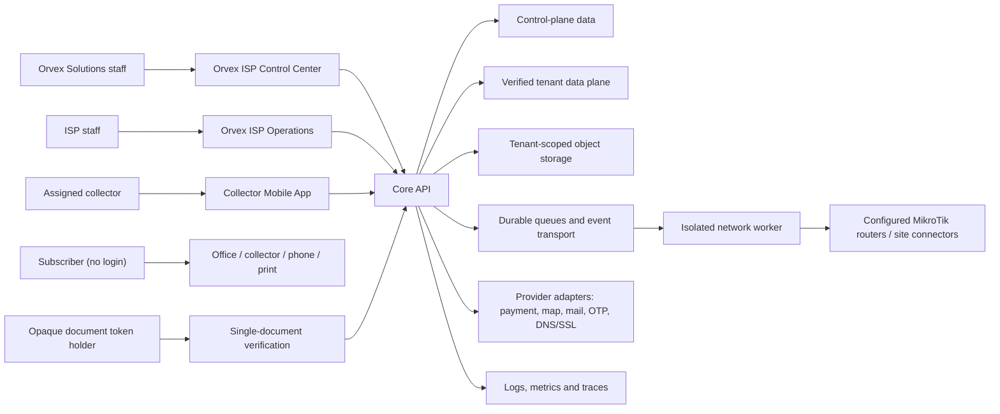
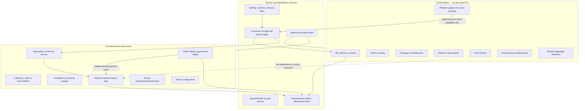
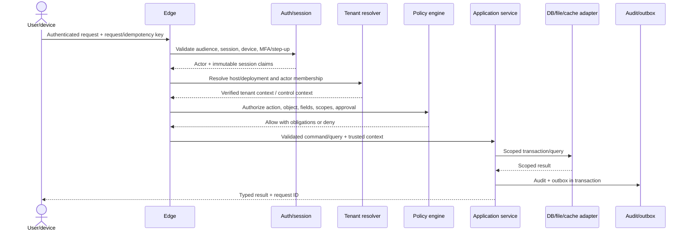
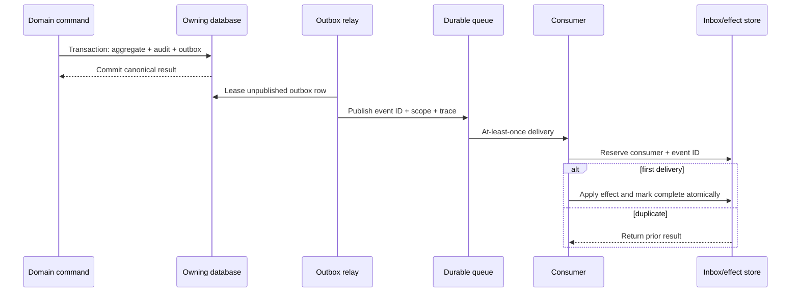
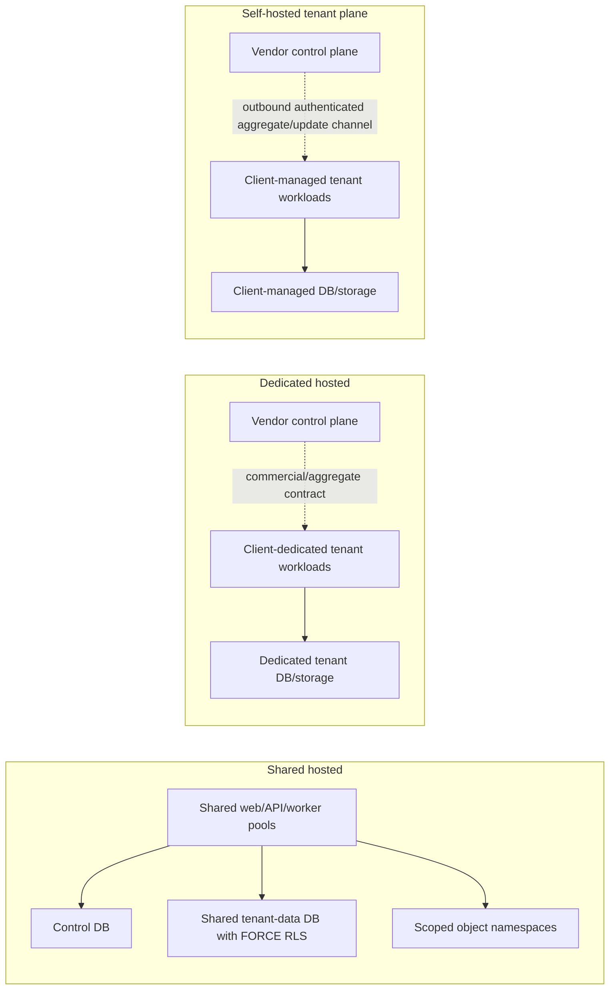

# Architecture overview

Status: Proposed baseline for Phase 1 review  
Decision authority: [ADRs](../adr/README.md)  
Requirements: [catalogue](../requirements/requirements.md) and
[traceability](../requirements/traceability.md)

## Architectural drivers

1. Prove tenant isolation across data, jobs, cache, files, realtime, exports, backups and support
   access (`PRD-SEC-001`).
2. Preserve immutable, exact-currency financial history under concurrency and retries (`PRD-FIN-*`).
3. Never let the Platform Subscription lifecycle affect Subscriber Internet Service (`PRD-BND-004`).
4. Let collector work survive process/network/printer failure without payment loss or duplication
   (`PRD-MOB-*`).
5. Reconcile uncertain network outcomes before retrying destructive commands (`PRD-NET-006`).
6. Operate shared, dedicated and self-hosted topologies without premature microservices.
7. Make English/Arabic, LTR/RTL, accessibility and observability foundational.

## System context

The Subscriber has no product identity. Public verification cannot navigate beyond one referenced
document. Platform staff cannot enter tenant raw-data paths unless the support gateway validates an
approved session.

## Repository and deployable units

| Unit                                 | Responsibility                                                                                            | Data authority                                               | Scaling                                                               |
| ------------------------------------ | --------------------------------------------------------------------------------------------------------- | ------------------------------------------------------------ | --------------------------------------------------------------------- |
| `apps/platform-web`                  | Vendor commercial, deployment, support and aggregate-health UI.                                           | None; typed Control API client.                              | Stateless web replicas/CDN assets.                                    |
| `apps/tenant-web`                    | Tenant operations UI.                                                                                     | None; typed Tenant API client.                               | Stateless web replicas/CDN assets.                                    |
| `apps/collect`                       | Assigned field collection, encrypted offline outbox, printing and reconciliation.                         | Encrypted device snapshots/drafts; server remains canonical. | Device-local.                                                         |
| `apps/api`                           | Fastify modular-monolith HTTP APIs, domain/application composition, authorization and schedules.          | Separate control and verified RLS tenant-data connections.   | Stateless API replicas.                                               |
| `workers`                            | Durable billing/integration jobs; isolated RouterOS adapter, command safety, attempts and reconciliation. | Narrow job/event contracts; credentials by reference.        | Separate pools, partitioned/concurrency-limited by work class/router. |
| `packages/contracts`                 | OpenAPI 3.1, events, generated clients and shared value schemas.                                          | Contract source of truth.                                    | Build-time.                                                           |
| `packages/ui` and app locale modules | Accessible bilingual components/tokens/translations.                                                      | Presentation only.                                           | Build-time.                                                           |
| `packages/observability`             | Correlation, redaction, semantic metrics/traces.                                                          | No business authority.                                       | Library/collector.                                                    |
| `infra`                              | Reproducible environments, networks, data services and monitoring.                                        | Desired deployment state.                                    | Per topology.                                                         |

## Core API bounded contexts

Code enforces inward dependencies: transport → application → domain; infrastructure implements
domain/application ports. Control and tenant domains share value types/contracts, not ORM models or
unsafe joins. Cross-context changes use commands within one transaction boundary or outbox events
when crossing processes/databases.

## Request and authorization path

Tenant scope is never established solely from a header, path, body, token string or mobile snapshot.
The resolver validates deployment/host, authenticated membership and server-side tenant metadata.
Adapters require a `VerifiedTenantContext` capability; an unscoped tenant repository constructor is
not exposed.

## Support access boundary

1. A Platform Support Agent links a request to a ticket, reason, requested capabilities and
   duration.
2. Policy finds an eligible different approver; approval is immutable and step-up protected.
3. The gateway mints a short-lived, nonce-bearing, non-refreshable capability containing tenant,
   ticket, approved permissions, approver and expiry.
4. The tenant application shows a persistent banner and publishes active-session visibility.
5. Every gateway request validates nonce revocation and re-runs object/field policy; reads as well
   as writes produce support audit evidence.
6. Expiry/revoke denies further access. Resolution closes the session; there is no silent extension.

## Financial transaction pattern

- Commands carry a server-defined scope plus idempotency key. A uniqueness constraint reserves
  `(tenant_id, operation_type, idempotency_key)` in the tenant-data database in the same transaction
  as the ledger write.
- Invoice/payment/allocation/correction writes occur in one tenant/control DB transaction with
  row/aggregate locking or optimistic version checks.
- Money is `(integer amount_minor, currency_code)` with scale from versioned currency/policy
  configuration, and cross-currency allocation is invalid. Fractional calculations use arbitrary
  precision then explicit rounding; conversion is a separate authorized record preserving both
  values and rate metadata.
- Posting assigns a scoped number, freezes the versioned policy/tax/price snapshot, writes
  audit/outbox, and makes the record immutable.
- Side effects (PDF, notification, network restore request, projection) consume the outbox
  idempotently. Side-effect failure never unposts finance.

## Event and job delivery

Delivery is at least once. Consumers must be idempotent; no component assumes exactly once. Replay
is permissioned, scoped and audited. Poison messages enter a DLQ with redacted error facts and a
runbook link.

## API conventions

- HTTPS JSON REST under `/api/v1`; OpenAPI 3.1 is authoritative. Breaking changes use a new version
  or an approved compatibility migration.
- Errors use `type`, stable `code`, localized-safe `message_key`, `request_id`, optional field
  `errors`, and retry metadata; diagnostics/secrets stay server-side.
- Cursor pagination is preferred for mutable large lists; page/offset is allowed for bounded
  administrative sets. All list routes enforce maximum page size and indexed sort tie-breakers.
- `Idempotency-Key` is required for posting, sync, provisioning, webhook effects and high-risk jobs.
  Same key+same normalized request returns the original result; same key+different request is `409`.
- Mutating aggregate commands carry an expected version where concurrent edits matter. `409` returns
  a classified conflict, never automatic overwrite.
- Dates/times use ISO 8601 UTC instants plus explicit local date/timezone for scheduled business
  rules. Money contracts accept checked safe-integer minor units and explicit currency; fractional
  JSON amounts are invalid.
- Rate policies are named by route risk and may combine user, IP, tenant, device and public-token
  dimensions.
- Internal worker endpoints use workload identity/mTLS or private signed service tokens and remain
  off public ingress.

## Realtime and cache

Realtime publishes only authorized, minimal state-change hints on channels derived from a
server-verified scope; clients refetch authoritative data. Connections reauthorize on
membership/policy/session changes. Cache keys always include plane, tenant scope, record/version and
schema version. Sensitive values have short TTL or are not cached. Cache is never authorization
evidence.

## Files and documents

Upload goes to a tenant-scoped quarantine object via a server-minted short-lived URL. Completion
validates ownership, content length, allowlisted extension and detected MIME, scans
malware/decompression risk, applies metadata policy, then promotes by immutable object ID.
Application records hold metadata/object reference, not public URLs. Downloads reauthorize and mint
short-lived signed URLs. Platform-client and tenant namespaces use distinct KMS/access policies. See
[ADR-0006](../adr/0006-file-storage-and-document-verification.md).

## Deployment topologies

Production starts with containers and managed or well-operated PostgreSQL/Redis/object storage. The
control DB is separate from the shared RLS tenant-data DB. Kubernetes is not required unless
measured scale/operations justify it. Network worker pools and heavy document/export jobs can scale
independently without decomposing the domain monolith.

## Failure handling and consistency

| Concern                          | Consistency / failure rule                                                                                                          |
| -------------------------------- | ----------------------------------------------------------------------------------------------------------------------------------- |
| Financial posting                | Strong transaction in owning DB; side effects async.                                                                                |
| Entitlement command              | Strong in control DB; tenant receives versioned event eventually; exceeding action fails safe while last valid entitlement remains. |
| Subscriber restore after payment | Payment posts first; restore request is an idempotent tenant-domain event; network result is visible and retriable/reconcilable.    |
| Dashboards                       | Eventual projections with freshness timestamp; financial drill-down reconciles to canonical ledger.                                 |
| Router state                     | Desired and observed state separate; uncertainty triggers observation, not blind retry.                                             |
| Mobile snapshots                 | Eventually consistent, validity-bounded and non-authoritative; server validates every synced command.                               |
| Files                            | Metadata transaction references quarantined/promoted state; missing scan/promotion cannot become downloadable.                      |
| Provider webhooks                | Validated into durable inbox before effect; replay/unknown events cannot mutate business state.                                     |

## Security and privacy summary

- OWASP ASVS target and full threat model are owned by security documentation; this architecture
  supplies enforcement points.
- Passwords use Argon2id parameters approved and benchmarked by Security; privileged MFA and step-up
  are mandatory as specified.
- Databases/Redis/metrics/workers are private; containers are non-root, least privilege and
  read-only where possible.
- Logs/traces use allowlisted attributes, opaque internal IDs, redaction and tenant-safe
  correlation. Subscriber names, phones, national IDs, proofs, secrets and raw document content are
  excluded.
- Export, backup restore, support, secret rotation, bulk network operations and deployment rollback
  are approval-controlled and audited.

## Architecture fitness functions

The build must fail on: forbidden control-subscription → tenant-network dependency; tenant
repositories without transaction-local verified context; tenant tables lacking non-null scope/FORCE
RLS; money fields accepting fractional/unsafe numbers; posted-record hard-delete/update endpoints;
events without scope/event ID/schema version; unsafe log fields; OpenAPI drift; unbounded list
routes; and missing isolation/idempotency tests for new boundaries.

## Related documents

- [Tenancy and data model](tenancy-and-data-model.md)
- [Capacity and performance](capacity-and-performance.md)
- [Architecture decision records](../adr/README.md)
- [Requirements risks and unresolved decisions](../requirements/assumptions-and-risks.md)
- [Dependency-aware task plan](../task-plan.md)
