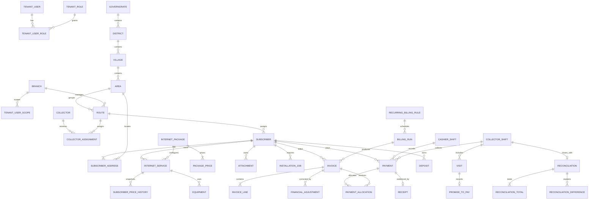
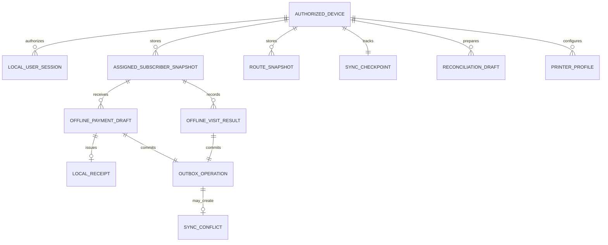
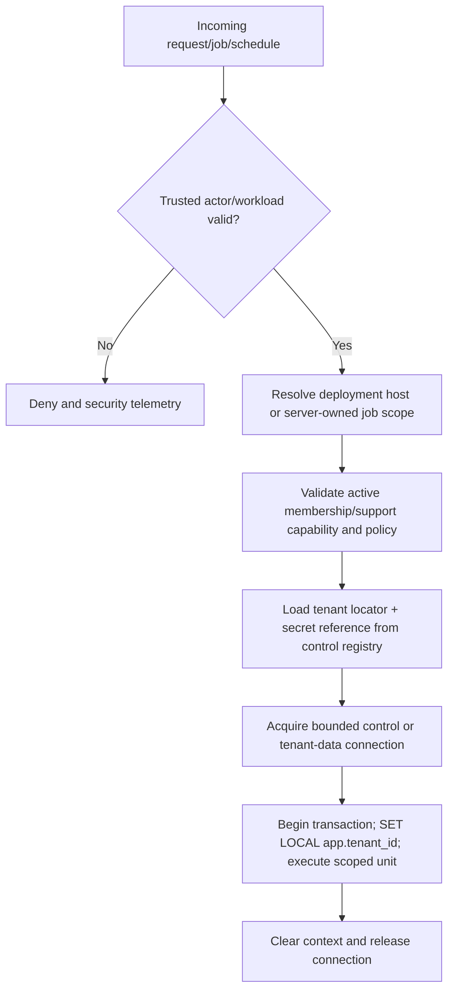

# Tenancy and data model

Status: Proposed logical model; migrations remain the executable authority after implementation.  
Decisions: [ADR-0002 Tenancy](../adr/0002-tenancy-and-data-isolation.md),
[ADR-0004 Money](../adr/0004-money-ledgers-and-corrections.md),
[ADR-0005 Events](../adr/0005-events-idempotency-and-jobs.md)

## Isolation model

| Plane     | Persistence                                                                                                               | Contains                                                                                                                                                                                | Explicitly excludes                                                                                |
| --------- | ------------------------------------------------------------------------------------------------------------------------- | --------------------------------------------------------------------------------------------------------------------------------------------------------------------------------------- | -------------------------------------------------------------------------------------------------- |
| Control   | Dedicated PostgreSQL control database                                                                                     | Platform identities, ISP clients/contacts, sales, package versions, entitlements, Platform Subscriptions, client finance, deployment/support metadata, aggregate health, control audit. | Subscriber PII, tenant invoices/payments, PPPoE credentials, raw tenant documents.                 |
| Tenant    | Separate shared-hosted PostgreSQL tenant-data database; every operational row carries non-null tenant scope and FORCE RLS | Tenant users/scopes, subscribers, Internet Services, tenant finance, collectors, installations, network desired/observed state/jobs, tenant audit.                                      | Vendor commercial ledgers; rows of any unverified tenant.                                          |
| Object    | Separate plane/tenant namespaces and access policies                                                                      | Quarantined/promoted attachments, proofs, PDFs, exports, backup artifacts.                                                                                                              | Public URLs, secrets in object metadata.                                                           |
| Device    | Encrypted mobile DB per authorized device/profile                                                                         | Minimum assigned snapshots, drafts, outbox, receipts, sync checkpoint/conflicts.                                                                                                        | Router credentials, unassigned subscriber dataset, authorization authority.                        |
| Telemetry | Central observability store with allowlisted attributes                                                                   | Service/route/status/latency, opaque deployment/tenant correlation, aggregate health.                                                                                                   | Subscriber name/phone/national ID, document/proof content, credentials, free-form sensitive notes. |

The control DB maps an authenticated deployment/host and membership to an opaque tenant
identity/deployment. Application code receives a `VerifiedTenantContext`, enters
`inTenantTransaction`, and sets `app.tenant_id` transaction-locally on the tenant-data connection.
Database roles have no RLS bypass; an unscoped/wrong scope sees or changes no tenant rows.
Dedicated/self-hosted placement may resolve a distinct database, but the contract never comes from
caller input or a serialized credential.

## Control-plane logical ERD

This diagram shows cardinality and aggregate roots, not every audit/timestamp/version column.

```mermaid
erDiagram
  PLATFORM_USER ||--o{ USER_ROLE : has
  PLATFORM_ROLE ||--o{ USER_ROLE : grants
  PLATFORM_ROLE ||--o{ ROLE_PERMISSION : includes
  PERMISSION ||--o{ ROLE_PERMISSION : defines
  PLATFORM_USER ||--o{ PLATFORM_SESSION : owns
  PLATFORM_USER ||--o{ MFA_DEVICE : enrolls

  ISP_CLIENT ||--o{ ISP_CONTACT : has
  ISP_CLIENT ||--o{ CLIENT_ADDRESS : has
  ISP_CLIENT ||--o{ CLIENT_DOCUMENT : owns
  ISP_CLIENT ||--o{ CLIENT_NOTE : records
  LEAD ||--o{ LEAD_ACTIVITY : has
  LEAD ||--o{ QUOTE : receives
  QUOTE ||--|{ QUOTE_LINE : contains
  LEAD o|--o| ISP_CLIENT : converts_to

  PACKAGE ||--|{ PACKAGE_VERSION : versions
  PACKAGE_VERSION ||--o{ PACKAGE_PRICE : prices
  PACKAGE_VERSION ||--o{ PACKAGE_FEATURE : enables
  PACKAGE_VERSION ||--o{ PACKAGE_LIMIT : limits
  ISP_CLIENT ||--o{ PLATFORM_SUBSCRIPTION : purchases
  PACKAGE_VERSION ||--o{ PLATFORM_SUBSCRIPTION : governs
  PLATFORM_SUBSCRIPTION ||--o{ SUBSCRIPTION_TRANSITION : records
  PLATFORM_SUBSCRIPTION ||--|{ ENTITLEMENT : snapshots
  ENTITLEMENT ||--o{ ENTITLEMENT_OVERRIDE : adjusts
  ISP_CLIENT ||--o{ USAGE_SNAPSHOT : reports

  ISP_CLIENT ||--o{ CLIENT_INVOICE : billed
  CLIENT_INVOICE ||--|{ CLIENT_INVOICE_LINE : contains
  ISP_CLIENT ||--o{ CLIENT_PAYMENT : pays
  CLIENT_PAYMENT ||--o{ CLIENT_PAYMENT_ALLOCATION : allocates
  CLIENT_INVOICE ||--o{ CLIENT_PAYMENT_ALLOCATION : receives
  CLIENT_INVOICE ||--o{ CLIENT_ADJUSTMENT : corrected_by

  ISP_CLIENT ||--o{ DEPLOYMENT : operates
  DEPLOYMENT ||--o{ DEPLOYMENT_STEP : executes
  DEPLOYMENT ||--o{ DOMAIN : serves
  DEPLOYMENT ||--o{ BACKUP : protects
  BACKUP ||--o{ RESTORE_TEST : verifies
  DEPLOYMENT ||--o{ HEALTH_SNAPSHOT : emits

  ISP_CLIENT ||--o{ PLATFORM_SUPPORT_TICKET : opens
  PLATFORM_SUPPORT_TICKET ||--o{ SUPPORT_ACCESS_REQUEST : justifies
  SUPPORT_ACCESS_REQUEST ||--o| SUPPORT_SESSION : authorizes
  ISP_CLIENT ||--o{ CONTROL_AUDIT_EVENT : scopes
  ISP_CLIENT ||--o{ AGGREGATE_TELEMETRY : contributes
```

### Control aggregate rules

- `PackageVersion` is immutable after publication. Subscriptions reference an exact version; changes
  create a new version/effective assignment.
- `EntitlementOverride` has reason, approver, effective interval and precedence. It cannot remove
  access to data already created.
- `PlatformSubscription` transitions are guarded and versioned. Its event namespace cannot be
  consumed by tenant network-command creation.
- Client finance uses the same posted-document rules as tenant finance but never shares
  sequences/balances.
- `SupportSession` stores token hash/nonce, never bearer token; approved scope and expiry cannot be
  widened in place.
- `AggregateTelemetry` uses an allowlist and contains no raw Subscriber identifier or PII dimension.

## Tenant logical ERD: organization, subscriber and finance

### Financial shape

Canonical posted money rows include `amount_minor bigint`, `currency_code char(3)`, and explicit
currency scale/rounding snapshot with range constraints. Application/API values are checked safe
integers; fractional proration/tax/rate work uses arbitrary-precision decimal/rational values before
explicit rounding to minor units. Allocation rows must match both payment and invoice currency
unless an explicit exchange transaction first creates the target-currency value. Balances are
derived projections, not freely editable columns.

`Invoice` stores immutable posting snapshots: tenant/client identity and address fields needed on
the document, price/tax/discount policy versions, currency, totals, number and posting/effective
times. `Payment` stores method, source/reference uniqueness facts, verification, payer context and
immutable posting identity. Corrections link `corrects_id`/`reverses_id` and never overwrite
originals.

## Tenant logical ERD: network, operations and reliability

```mermaid
erDiagram
  INTERNET_SERVICE ||--o| PPPOE_ACCOUNT : provisions
  MIKROTIK_ROUTER ||--o{ PPPOE_ACCOUNT : hosts
  MIKROTIK_ROUTER ||--|| ROUTER_CREDENTIAL_REFERENCE : uses
  BANDWIDTH_PROFILE ||--o{ PPPOE_ACCOUNT : configures
  IP_POOL ||--o{ PPPOE_ACCOUNT : assigns
  VLAN ||--o{ PPPOE_ACCOUNT : segments
  PPPOE_ACCOUNT ||--o{ ACTIVE_SESSION_OBSERVATION : observes
  PPPOE_ACCOUNT ||--o{ SESSION_HISTORY : records

  INTERNET_SERVICE ||--o{ NETWORK_JOB : targets
  MIKROTIK_ROUTER ||--o{ NETWORK_JOB : routes
  NETWORK_JOB ||--o{ NETWORK_JOB_ATTEMPT : attempts
  BULK_NETWORK_BATCH ||--|{ NETWORK_JOB : expands_to
  NETWORK_JOB ||--o{ NETWORK_OBSERVATION : reconciles

  SUBSCRIBER ||--o{ INTERNAL_SUPPORT_TICKET : concerns
  INVOICE o|--o{ INTERNAL_SUPPORT_TICKET : links
  PAYMENT o|--o{ INTERNAL_SUPPORT_TICKET : links
  NETWORK_JOB o|--o{ INTERNAL_SUPPORT_TICKET : links

  OUTBOX_EVENT }o--|| IDEMPOTENCY_RECORD : correlates
  INBOX_RECEIPT }o--|| OUTBOX_EVENT : consumes
  WEBHOOK_DELIVERY }o--o| IDEMPOTENCY_RECORD : deduplicates
  EXPORT_JOB }o--o| ATTACHMENT : produces
  IMPORT_JOB ||--o{ IMPORT_ROW_RESULT : reports
  TENANT_AUDIT_EVENT }o--o| APPROVAL_REQUEST : evidences
```

`RouterCredentialReference` contains provider/secret-manager identifiers and metadata only.
`NetworkJob` contains deterministic operation type, normalized desired state/hash, target, router,
idempotency/request/correlation IDs, status, approval/audit references and current observed-state
relation. Attempts contain classified outcomes. `reconciliation_required` prevents a new command
attempt until an observation resolves uncertainty or an authorized operator chooses a documented
safe action.

## Mobile local model

Local IDs are UUIDs created with cryptographically secure randomness. A payment operation has stable
device ID, local operation ID, tenant server-issued assignment/scope version, exact
decimal/currency, local occurred time, server-recorded time after sync, and payload hash.
`LocalReceipt` is evidence of local acceptance and later maps to a canonical server receipt; it is
never silently discarded or renumbered in place.

## Global mandatory columns and constraints

| Concern        | Required design                                                                                                                                                                                                                                                          |
| -------------- | ------------------------------------------------------------------------------------------------------------------------------------------------------------------------------------------------------------------------------------------------------------------------ |
| Identity       | UUID/ULID-style opaque primary IDs; human numbers are separate scoped business keys.                                                                                                                                                                                     |
| Tenant scope   | Every shared tenant-data row has non-null `tenant_id`, indexed with access paths and protected by ENABLE/FORCE RLS. Every external event/object/cache/log carries verified opaque tenant scope. Dedicated placement keeps tenant scope for contract consistency/defense. |
| Concurrency    | Aggregate `version` or row lock; commands include expected version where stale writes are unsafe.                                                                                                                                                                        |
| Time           | `created_at`, `updated_at` where mutable, and domain-specific `occurred_at`, `effective_at`, `posted_at`, `recorded_at` UTC. Never use device time as canonical posting time.                                                                                            |
| Soft lifecycle | `archived_at`/state for operational records; posted/audit rows are retained and immutable. Soft delete is not an authorization boundary.                                                                                                                                 |
| Audit          | Actor type/ID, delegated/support context, request/session/device/IP, reason, before/after safe snapshot, result and timestamp. Sensitive values are redacted/hashed.                                                                                                     |
| Idempotency    | Unique scope+operation+key, canonical request hash, lifecycle/expiry and stored response/result reference. Financial keys are retained at least as long as reversal/audit obligations.                                                                                   |
| Numbering      | Unique `(scope, document_type, sequence_series, number)` assigned transactionally at posting.                                                                                                                                                                            |
| Files          | Object ID, plane/tenant namespace, owner aggregate, hash, detected MIME, size, scan/promotion state, retention/legal hold; no bearer URL.                                                                                                                                |
| Events         | Event ID, aggregate type/ID/version, schema version, plane/tenant scope, occurred/recorded time, trace/request ID, payload; no secret/unsafe PII.                                                                                                                        |

## Tenant resolution and connection lifecycle

No transaction may span control+tenant data planes or two dedicated tenant placements. Shared
tenant-data transactions operate on exactly one verified tenant; cross-tenant runtime queries are
prohibited even though rows share storage. A workflow needing both planes commits to its owner,
writes an outbox event, and exposes pending/eventual state. Cross-tenant platform reporting reads
allowlisted aggregate projections only. Fan-out creates one scoped job/transaction per tenant and
clears transaction-local context between iterations.

## Cache, queue, object and realtime namespaces

Canonical key prefix: `{environment}:{plane}:{opaque_tenant_or_control}:{schema}:{resource}:{key}`.
A tenant scope is derived server-side before access. Queue messages include scope, deployment,
event/job ID, schema version, correlation and minimal payload; consumers reject missing/mismatched
scope. Object IAM limits a workload to the required prefix/bucket. Realtime topics are opaque and
subscribed through an authorization callback; knowing a topic name grants nothing.

## Migration strategy

1. Control schema and tenant schema have independent ordered migrations and compatibility manifests.
2. Shared-hosted tenant schema migrations are fleet-wide and must add `tenant_id`, indexes and FORCE
   RLS before a table becomes reachable. Dedicated/self-hosted provisioning applies the same signed
   baseline/migrations idempotently and records schema version.
3. Fleet rollout prechecks backups, disk/locks/version compatibility, then uses bounded waves.
   Failures stop later waves; completed tenants remain on a backwards-compatible application
   version.
4. Use expand → backfill/dual-read as needed → switch → contract in a later release. Never
   auto-down-migrate a destructive change.
5. Backfills are resumable, tenant-scoped, rate-limited, observable and audited. A migration cannot
   query another tenant.
6. Dedicated/self-hosted instances publish signed migration status/health without raw tenant data.
7. Restore tooling verifies tenant identity before repointing storage/connection metadata and
   smoke-tests isolation plus finance totals.

## Index and query baseline

Every access path used by a list, job lease, idempotency check, allocation, sequence, due list or
audit timeline needs a reviewed composite index with stable tie-breaker. Likely baselines include
`(status, due_at, id)`, `(subscriber_id, posted_at, id)`, `(route_id, due_date, id)`,
`(router_id, status, available_at, id)`, `(aggregate_type, aggregate_id, version)`, and unique
idempotency/number/reference indexes. Exact indexes follow query plans and load data; avoid
indiscriminate indexes on sensitive/high-write fields.

## Data lifecycle

- Retention is configurable but constrained by approved legal/financial/audit minimums. Archival
  preserves referential/audit integrity.
- Public verification token revocation does not delete the underlying posted document.
- Mobile cached assignments expire and are securely removed after policy/revocation/successful
  handoff, subject to preserving unsynced evidence safely.
- Tenant export is authorized, asynchronous, encrypted, checksummed, time-limited and audited.
  Formula injection is neutralized.
- Tenant deletion is not automated until DEC-008 is approved; any future secure deletion must
  include DB, objects, caches, projections, backups/expiry and evidence.

## Invariant test map

| Invariant                                              | Primary enforcement                                                                     | Planned test                        |
| ------------------------------------------------------ | --------------------------------------------------------------------------------------- | ----------------------------------- |
| One tenant cannot access another anywhere.             | Resolver + transaction-local context + FORCE RLS/non-bypass role + scoped adapters/IAM. | `T-ISO-ALL-001`                     |
| Same payment key yields at most one posted payment.    | Unique idempotency + posting transaction.                                               | `T-IDEMP-PAY-001`, `T-CONC-PAY-001` |
| Posted finance cannot mutate/delete.                   | API/domain guards + DB privileges/triggers/constraints as appropriate.                  | `T-DB-IMMUT-001`                    |
| Allocations cannot exceed available matching currency. | Domain calculation + transaction lock/constraint.                                       | `T-PROP-ALLOC-001`                  |
| Restriction never changes Internet Service.            | Bounded-context dependency/event allowlist.                                             | `T-ARCH-BOUND-001`, `T-NET-NEG-001` |
| Support access is approved/scoped/expiring/revocable.  | Gateway capability + policy + audit.                                                    | `T-ISO-SUPPORT-001`                 |
| Uncertain network effect is not blindly retried.       | Job state machine and attempt classifier.                                               | `T-NET-UNCERTAIN-001`               |
| Revoked device cannot sync/read assignments.           | Device/token session check on every mobile route.                                       | `T-MOB-REVOKE-001`                  |
