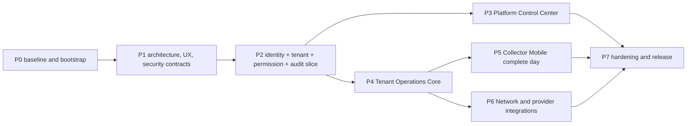

# Dependency-aware delivery task plan

Status date: 2026-08-09  
Delivery owner: Lead agent / Engineering lead  
Source: [requirements catalogue](requirements/requirements.md)  
Evidence register: [traceability matrix](requirements/traceability.md)  
Risks/decisions: [live register](requirements/assumptions-and-risks.md)

## Rules of execution

- Status values: `Done` means the output exists and its author checks ran; it does **not** mean its
  phase gate passed. `Review` means independent/owner review is pending. `Ready` has satisfied
  prerequisites. `Blocked` requires an exact external blocker/decision ID. `Planned` has unmet
  dependencies.
- A task owner owns only the listed paths/contracts. Cross-owner edits require a handoff before
  editing. One owner writes a migration range/file; another reviews it.
- Every task handoff states scope/exclusions, inputs/contracts, owned paths, outputs, commands/tests
  actually run, security/tenancy risks, completion evidence and unresolved notes.
- Critical finance, tenant isolation, support access, mobile sync and network automation need a
  reviewer who did not author the feature. The final reviewer authors no feature under review.
- Do not start dependent feature screens against invented API/status contracts. Stabilize domain/API
  contracts first, then generate clients and implement UI in parallel.
- No gate closes on an author's claim. The Delivery owner runs integrated commands and links
  immutable evidence in the traceability matrix.

## Ownership map

| Workstream             | Primary ownership                                               | Exclusions / required reviewers                                                  |
| ---------------------- | --------------------------------------------------------------- | -------------------------------------------------------------------------------- |
| Product & Requirements | `docs/requirements/**`, requirement/evidence mapping            | Cannot approve own requirement exception; Product owner approves.                |
| Architecture & Data    | `docs/architecture/**`, `docs/adr/**`, schema conventions       | Security reviews tenancy/auth/files; Finance reviews money.                      |
| UX & Design System     | `docs/ux/**`, `packages/ui`, UX/i18n behavior                   | QA reviews accessibility/RTL; domain owners review financial/network meaning.    |
| Platform Backend       | Control-plane contexts/migrations/APIs/tests                    | Finance module reviewed by Finance/Security; no tenant module ownership.         |
| Tenant Backend         | Tenant contexts/migrations/APIs/tests                           | Finance/tenancy reviewed independently; no RouterOS calls.                       |
| Identity/Security      | Identity/policy/approval/support gateway; `docs/security/**`    | Feature teams integrate; Security cannot be sole final reviewer of its own code. |
| Network & Integrations | isolated processes under `workers`, provider adapters/contracts | No Platform Subscription consumer; Security/ISP Network review.                  |
| Platform Web           | `apps/platform-web`                                             | No direct DB/provider access.                                                    |
| ISP Web                | `apps/tenant-web`                                               | No direct DB/RouterOS access.                                                    |
| Mobile                 | `apps/collector-mobile`, mobile sync client/printer adapters    | Server sync/finance contract coordinated with Tenant Backend; Security review.   |
| QA & Automation        | `docs/testing/**`, cross-surface E2E/performance fixtures       | Does not silently change feature behavior to make tests pass.                    |
| DevOps & SRE           | `infra/**`, CI/CD, runbooks/operations                          | Security reviews secrets/network/images; owners approve RPO/RTO.                 |
| Independent Review     | Evidence-only final architecture/security/UX/quality review     | Authors no reviewed critical feature.                                            |

## Critical path

Within Phase 4, exact-currency ledger and location/subscriber foundations precede collector
reconciliation and network activation. Phase 5/6 may start contract/fake work earlier, but their
end-to-end gates depend on Phase 4 canonical server workflows.

## Phase 0 — discovery and repository bootstrap

| ID   | Task                                                                      | Depends    | Owner                | Output                                                 | Tests / review gate                                               | Status                                                |
| ---- | ------------------------------------------------------------------------- | ---------- | -------------------- | ------------------------------------------------------ | ----------------------------------------------------------------- | ----------------------------------------------------- |
| T0.1 | Inspect repo/assets/tools and preserve existing work.                     | —          | Delivery             | Inventory, constraints, tool versions.                 | Git/status and reference audit recorded.                          | Done (empty repo confirmed)                           |
| T0.2 | Baseline requirements, glossary, assumptions, risks and traceability IDs. | T0.1       | Product              | `docs/requirements/**`                                 | Internal-link/coverage review; Product/Security/Finance approval. | Review                                                |
| T0.3 | Baseline architecture/data/capacity and ADR set.                          | T0.1, T0.2 | Architecture         | `docs/architecture/**`, `docs/adr/**`                  | Mermaid/link review; Security/Finance/SRE reviews named ADRs.     | Review                                                |
| T0.4 | Establish repository conventions/ownership/commands.                      | T0.1       | Delivery             | `AGENTS.md`, root docs.                                | Each agent acknowledges boundaries; no conflicting path owners.   | Review (files exist; integrated review pending)       |
| T0.5 | Scaffold pinned monorepo, format/lint/type/build orchestrator.            | T0.3       | Developer Experience | apps/services/packages skeleton, lockfiles/toolchains. | Clean install; lint/type/test/build command.                      | Review (scaffold exists; integrated evidence pending) |
| T0.6 | Reproducible local services and safe bilingual demo seed skeleton.        | T0.5       | SRE + Backend        | Compose/local env, DB/Redis/object/mail/router fakes.  | One bootstrap; health smoke; no secret/real PII.                  | Planned                                               |
| T0.7 | Base CI, dependency/secret scans and change detection.                    | T0.5       | SRE + QA             | CI pipeline and reports.                               | Deliberate failure blocks; cache does not bypass checks.          | Planned                                               |

**Phase 0 gate:** T0.2–T0.7 reviewed; repository builds; documented core commands run; terminology
has no collision; ADR/decision owners named; no secret/real data. Evidence owner: Delivery.
Reviewers: Product, Architecture, Security, QA.

## Phase 1 — architecture, UX, contracts and security baseline

| ID   | Task                                                                                                    | Depends          | Owner                  | Output                                                            | Tests / review gate                                                                  | Status                       |
| ---- | ------------------------------------------------------------------------------------------------------- | ---------------- | ---------------------- | ----------------------------------------------------------------- | ------------------------------------------------------------------------------------ | ---------------------------- |
| T1.1 | Approve stack, tenancy, auth, money, events, files, mobile, network, deployment and observability ADRs. | T0.2, T0.3       | Architecture           | Accepted/updated ADRs and decision outcomes.                      | Named reviewers sign; conflicts resolved, no silent divergence.                      | Planned                      |
| T1.2 | Define control/tenant schema conventions, migrations, factories and seed contracts.                     | T1.1             | Architecture + Backend | Initial migrations/schema docs, tenant registry/connection ports. | Migration up/compatibility; DB constraints; two-tenant fixtures.                     | Planned                      |
| T1.3 | Define OpenAPI/error/pagination/idempotency/event contracts and generated client pipeline.              | T1.1, T0.5       | API Architecture       | `packages/contracts`, OpenAPI 3.1 baseline.                       | Spec lint/breaking check; generated client compile; request ID/idempotency contract. | Planned                      |
| T1.4 | Define navigation, design tokens/components, bilingual/RTL/responsive/accessibility behavior.           | T0.2, T0.5       | UX                     | `docs/ux/**`, UI/i18n packages, Storybook.                        | EN/AR LTR/RTL component/a11y/visual checks.                                          | In progress (external owner) |
| T1.5 | Threat model, security requirement map and baseline hardening.                                          | T0.2, T0.3       | Security               | `docs/security/**`, abuse cases, security test plan.              | ASVS/API/MASVS target; isolation/support/mobile/network/files review.                | In progress (external owner) |
| T1.6 | Implement outbox/inbox, idempotency, scoped job and audit foundations.                                  | T1.2, T1.3, T1.5 | Core Backend           | Shared infrastructure ports/adapters.                             | Duplicate/restart/replay/DLQ/audit tests.                                            | Planned                      |
| T1.7 | Implement tenant resolver/connection, scoped cache/file/realtime/job adapters.                          | T1.2, T1.5       | Core Backend           | `VerifiedTenantContext` enforcement.                              | `T-ISO-ALL-001` skeleton across boundaries.                                          | Planned                      |
| T1.8 | Implement observability/redaction and local seed/simulator foundations.                                 | T0.6, T1.5, T1.6 | SRE + Network          | Correlation libraries, dashboards skeleton, fakes.                | Sentinel secret/PII redaction; trace through queue; fake health.                     | Planned                      |

**Phase 1 gate:** architecture/security/design reviews pass; two-tenant isolation foundation is
executable; contracts generate; EN/AR LTR/RTL shell components render; local environment and fakes
are healthy. Finance signs money policy assumptions or production finance remains blocked.

## Phase 2 — identity, tenancy, permission and audit vertical slice

| ID   | Task                                                                              | Depends          | Owner              | Output                              | Tests / review gate                                                | Status  |
| ---- | --------------------------------------------------------------------------------- | ---------------- | ------------------ | ----------------------------------- | ------------------------------------------------------------------ | ------- |
| T2.1 | Web/mobile identity, sessions, MFA/recovery and device authorization.             | T1.3, T1.5, T1.7 | Identity           | Auth/session APIs and clients.      | Password/MFA/recovery/CSRF/rotation/reuse/revoke matrix.           | Planned |
| T2.2 | Permission catalogue, scopes, policy engine, step-up and dual approval.           | T2.1, T1.3       | Identity           | Central policy/approval module.     | Role/object/field/scope matrix; self-approval/stale/replay denial. | Planned |
| T2.3 | Append-only audit with support/delegation context.                                | T1.6, T2.2       | Core Backend       | Audit writer/query/export policies. | Immutability/completeness/access-audit tests.                      | Planned |
| T2.4 | Platform and tenant shell/context selectors with bilingual denied/session states. | T1.4, T2.1, T2.2 | Platform + ISP Web | Authenticated shells.               | Browser E2E EN/AR/RTL/a11y/session expiry.                         | Planned |
| T2.5 | Mobile authorization shell/encrypted storage/session state.                       | T1.4, T2.1       | Mobile             | Sign-in/device/OTP/account shell.   | Key storage, revoke, offline locked-state tests.                   | Planned |
| T2.6 | One secure tenant-scoped API endpoint and UI in each web shell.                   | T2.2..T2.4, T1.7 | Backend + Web      | Walking vertical slice.             | Cross-tenant/permission/audit/request trace E2E.                   | Planned |

**Phase 2 gate:** authorization matrix and full-boundary two-tenant tests pass; revocation works;
privileged change audit is complete; shell/access/error flows pass EN/AR/RTL/a11y. Independent
reviewer: Security/QA not authoring T2.2/T2.6.

## Phase 3 — Platform Control Center

| ID   | Task                                                                                | Depends                          | Owner                | Output                                 | Tests / review gate                                                                | Status  |
| ---- | ----------------------------------------------------------------------------------- | -------------------------------- | -------------------- | -------------------------------------- | ---------------------------------------------------------------------------------- | ------- |
| T3.1 | Leads, activities, quotations, accepted documents and idempotent client conversion. | P2 gate, T1.3                    | Platform Backend/Web | Sales contexts/screens.                | Lead-to-client success/denied/retry/document tests.                                | Planned |
| T3.2 | ISP client profile/contacts/documents/activity/lifecycle commands.                  | T3.1                             | Platform Backend/Web | Required tabs/actions.                 | Field/permission/upload/archive/reopen/audit E2E.                                  | Planned |
| T3.3 | Versioned package/add-on/price/entitlement/usage/override contexts.                 | P2 gate, finance policy          | Platform Backend/Web | Catalogue and enforcement.             | Version/limit/override/usage/conflict/property tests.                              | Planned |
| T3.4 | Platform Subscription state machine and protected restriction/recovery.             | T3.3, T1.6                       | Platform Backend/Web | Lifecycle commands/events/UI.          | Transition property/E2E; no-network dependency negative test.                      | Planned |
| T3.5 | Client invoices/payments/allocations/corrections/statements/PDF.                    | finance ADR approval, T3.2, T1.6 | Platform Finance     | Commercial ledger/screens.             | Money/tax/concurrency/idempotency/PDF/correction E2E.                              | Planned |
| T3.6 | Idempotent provisioning, domain/SSL, backup/update/rollback metadata/workflow.      | T3.2, T0.6, T1.8                 | Deployments + SRE    | Provision/deployment UI/API/adapters.  | Retry every step, no duplicate resource, secret-safe logs, staging smoke/rollback. | Planned |
| T3.7 | Platform tickets/SLA and controlled support sessions/banner gateway.                | T2.2..T2.4, T3.2                 | Support + Identity   | Support workflows.                     | Ticket→approval→access→expiry/revoke E2E and isolation suite.                      | Planned |
| T3.8 | Platform dashboards/reports/admin.                                                  | T3.2..T3.7                       | Platform Backend/Web | Projections, cards, reports, settings. | Card/list reconciliation, aggregate privacy, export safety/audit.                  | Planned |

**Phase 3 gate:** lead-to-live, monthly client billing, package change, grace/restrict/restore,
support session and termination flows pass E2E/security; every KPI drills down; no raw tenant PII or
subscriber network effect. Reviewers: Finance, Security, QA, Product.

## Phase 4 — ISP Operations core

| ID   | Task                                                                                          | Depends                 | Owner              | Output                                     | Tests / review gate                                                        | Status  |
| ---- | --------------------------------------------------------------------------------------------- | ----------------------- | ------------------ | ------------------------------------------ | -------------------------------------------------------------------------- | ------- |
| T4.1 | Organization, branches, locations, routes, roles and versioned tenant policies.               | P2 gate, T1.2           | Tenant Backend/Web | Configuration foundations.                 | Hierarchy/scope/effective-policy/import seed tests.                        | Planned |
| T4.2 | Subscribers, addresses, service, packages/price history, equipment and protected attachments. | T4.1, file service      | Tenant Backend/Web | Subscriber aggregate/profile/import.       | Duplicate, PII fields, file abuse, archive and onboarding tests.           | Planned |
| T4.3 | Tenant invoices, recurring/bulk billing, VAT, proration and immutable corrections.            | T4.2, finance ADR, T1.6 | Tenant Finance/Web | Billing contexts/screens/jobs/PDF.         | Property/concurrency/idempotency/retry-only-failed/Arabic PDF.             | Planned |
| T4.4 | Payments, allocations, receipts, deposit/credit and office cashier shifts.                    | T4.3                    | Tenant Finance/Web | Payment/cash workflows.                    | Concurrent/duplicate/method/proof/printer/correction/closing E2E.          | Planned |
| T4.5 | Collectors, assignments, shifts, visits, handover and discrepancy reconciliation.             | T4.1, T4.4              | Tenant Finance/Web | Collector/reconciliation server workflows. | Currency/method separation, difference/approval/close/reopen E2E.          | Planned |
| T4.6 | Installation queue/checklist/network handoff and internal tenant support.                     | T4.2                    | Tenant Backend/Web | Focused installation/support flows.        | Blocked/prerequisite/activation/linkage/permission E2E.                    | Planned |
| T4.7 | Tenant dashboards/reports/import/export and safe async artifacts.                             | T4.2..T4.6              | Tenant Backend/Web | Projections/reports/jobs.                  | Drill-down reconciliation, pagination/load, formula/file/tenant isolation. | Planned |

**Phase 4 gate:** onboarding, recurring billing, office payment, correction, collector
reconciliation, reports and Arabic PDFs pass; concurrent/retry invariants and cross-tenant suite
pass; VAT-off path is proven. Independent Finance/Security/QA review required.

## Phase 5 — Collector Mobile App

| ID   | Task                                                                           | Depends                        | Owner                   | Output                                          | Tests / review gate                                                       | Status  |
| ---- | ------------------------------------------------------------------------------ | ------------------------------ | ----------------------- | ----------------------------------------------- | ------------------------------------------------------------------------- | ------- |
| T5.1 | Mobile bootstrap/assignment delta contracts and minimum-data snapshots.        | T4.1, T4.2, T2.5               | Mobile + Tenant Backend | Assignment/server sync APIs.                    | Scope/reassignment/expiry/revoke/offline tests.                           | Planned |
| T5.2 | Encrypted local schema, migrations, persist-before-success outbox/checkpoints. | T2.5, ADR-0007                 | Mobile                  | Durable store/sync engine.                      | Process-kill/storage/migration/reorder/duplicate fault tests.             | Planned |
| T5.3 | Route/search/subscriber/visit/payment/allocation/proof flows.                  | T5.1, T5.2, T4.4               | Mobile                  | Core collector screens/workflows.               | Online/offline exact-currency payment and visit E2E.                      | Planned |
| T5.4 | Canonical sync/idempotency/conflict resolution server and client.              | T5.2, T5.3, T1.6               | Mobile + Tenant Finance | Accepted/conflict/rejected/retry state machine. | Concurrent devices, same/different payload, stale assignment, clock skew. | Planned |
| T5.5 | Receipt/PDF/share/Bluetooth printer adapter and failure recovery.              | T5.3, finance receipt contract | Mobile                  | Local/canonical receipt and printer setup.      | Fake printer success/fail/disconnect/reprint; payment never lost.         | Planned |
| T5.6 | End-of-day reconciliation/report and Android release hardening.                | T5.4, T5.5, T4.5               | Mobile                  | Complete-day flow/release build.                | Eight-hour online/offline day; discrepancy closure; a11y/security/build.  | Planned |

**Phase 5 gate:** a complete day succeeds online and offline; repeated/interrupted sync creates no
duplicate/lost payment; conflicts recover; revoked device blocked; print failure preserves payment;
Android production development/release build passes. Independent Security/Finance/QA review.

## Phase 6 — MikroTik and external integrations

| ID   | Task                                                                            | Depends                      | Owner                    | Output                                           | Tests / review gate                                                 | Status                           |
| ---- | ------------------------------------------------------------------------------- | ---------------------------- | ------------------------ | ------------------------------------------------ | ------------------------------------------------------------------- | -------------------------------- |
| T6.1 | Versioned network job contract, desired/observed model and simulator matrix.    | T1.3, T1.6, ADR-0008         | Network                  | Worker contract/simulator/job state.             | Success/timeout-before/after/partial/offline/auth/throttle/restart. | Planned                          |
| T6.2 | Router/credential/profile/pool/VLAN/session administration and health.          | T4.1, T6.1                   | Network + Tenant Web     | Network configuration/observations.              | Secret/egress/field permissions/freshness/retention.                | Planned                          |
| T6.3 | PPPoE lifecycle, payment restore and package-change integration.                | T4.2..T4.4, T6.1             | Network + Tenant Backend | Authorized network commands.                     | Safe retry/reconcile; no control-subscription consumer; audit E2E.  | Planned                          |
| T6.4 | Exact-preview bulk network batches and partial recovery.                        | T6.2, T6.3, T2.2             | Network + Tenant Web     | Bulk screens/jobs/results/export.                | Approval, frozen targets, conflicts, partial/retry/DLQ/load.        | Planned                          |
| T6.5 | OMT/Whish/manual/payment/bank adapters and webhook inbox.                       | T1.3, T4.4                   | Integrations             | Manual/fake providers, disabled live flags.      | Contract/signature/replay/idempotency/unknown/health.               | Planned                          |
| T6.6 | Maps/printer/object/mail/WhatsApp/OTP/DNS-SSL adapter completion.               | owning feature contracts     | Integrations             | Provider-neutral adapters/guides.                | Fake/contract, least-data, feature-disabled and failure tests.      | Planned                          |
| T6.7 | Certify production RouterOS adapter/site connector against approved lab matrix. | T6.1..T6.4, DEC-006 resolved | Network + Security       | Supported versions/topologies/evidence/runbooks. | Representative hardware/lab failure/recovery; secret rotation.      | Blocked (DEC-006 external input) |

**Phase 6 gate:** simulator failure matrix and production lab scope pass; secrets do not leak;
uncertain results reconcile before repeat; subscription restriction cannot dispatch network work;
all adapters have fake/contract tests and undocumented live providers remain disabled.

## Phase 7 — hardening, operations and release readiness

| ID   | Task                                                                                       | Depends                | Owner                         | Output                                                                 | Tests / review gate                                                          | Status                             |
| ---- | ------------------------------------------------------------------------------------------ | ---------------------- | ----------------------------- | ---------------------------------------------------------------------- | ---------------------------------------------------------------------------- | ---------------------------------- |
| T7.1 | Execute reference/large load, soak, queue backlog and failover plan.                       | P3–P6 gates            | QA Performance + SRE          | Immutable performance report.                                          | All capacity test IDs; tune/retest regressions.                              | Planned                            |
| T7.2 | Full security verification/remediation.                                                    | P3–P6 gates            | Security                      | SAST/SCA/secret/container/DAST/auth/isolation/upload/session evidence. | No critical/high open; accepted medium record complete.                      | Planned                            |
| T7.3 | Full EN/AR, RTL, accessibility, responsive/browser/mobile visual/content review.           | P3–P6 gates            | UX + QA                       | Review reports and fixes.                                              | WCAG 2.2 AA target; Arabic PDF/receipt and task preservation.                | Planned                            |
| T7.4 | Complete CI/CD, immutable artifacts, IaC, monitoring/alerts and runbooks.                  | T0.7, T3.6, T1.8       | SRE                           | Release/deployment/operations package.                                 | Staging release, alert drills, version/scan/SBOM/sign evidence.              | Planned                            |
| T7.5 | Backup/restore and disaster-recovery exercises.                                            | T7.4, DEC-009 resolved | SRE                           | Control/tenant/full/object restore records.                            | RPO/RTO and application/isolation/finance smoke pass.                        | Blocked (DEC-009 owner acceptance) |
| T7.6 | Complete operator/admin/finance/collector/network/support documentation and training data. | Stable features        | Product + Domain owners       | User/operations docs.                                                  | Commands/workflows validated against release artifact.                       | Planned                            |
| T7.7 | Traceability and independent final review against all 20 acceptance criteria.              | T7.1..T7.6             | Independent Review + Delivery | Evidence bundle/findings/final decision.                               | Every Must mapped; no author self-approval; findings remediated/re-reviewed. | Planned                            |

**Phase 7/final gate:** staging deploy and restore exercise succeed; all
builds/tests/scans/a11y/RTL/E2E/load gates pass; no critical/high findings; every requirement has
implementation/test/evidence; production approvals, provider/legal decisions and residual risks are
explicit.

## Review-gate checklist

At every phase gate, Delivery records: completed requirement IDs and changed paths; exact
commands/environments/results; failures found and fixed; migration/backfill/rollback result;
security/tenant findings and reviewer; UX/a11y/RTL evidence where applicable; current risk/decision
changes; known limitations; next ready tasks. Failed checks remain failed until rerun evidence
exists.

## Current blockers and decisions

The documentation baseline is not externally blocked. Production finance, live providers, RouterOS
certification and release readiness depend respectively on DEC-001/010, DEC-005, DEC-006 and
DEC-009. Reversible implementation continues in safe default/manual/simulator modes; the affected
production gates remain open.
